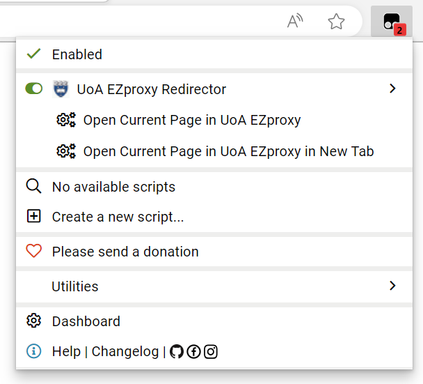
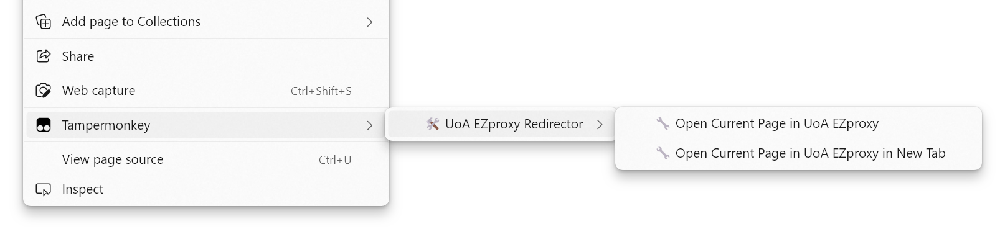

# UoA EZproxy Redirector

A tiny script that adds menu commands in script managers such as [TamperMonkey](https://www.tampermonkey.net/) and [ViolentMonkey](https://violentmonkey.github.io/) to open the current page in [UoA EZproxy](https://ezproxy.auckland.ac.nz/), making it easy to access resources subscribed by the University Library around the world.

**EZproxy only works on the sites subscribed by the University Library. If you try to access a site through EZproxy that is not subscribed by them, then you will be redirected back to the original address of the site.**

## Get Started

1. Install [TamperMonkey](https://www.tampermonkey.net/) **or** [ViolentMonkey](https://violentmonkey.github.io/) in your browser.

2. Click [this](https://raw.githubusercontent.com/SpecterShell/UoA-EZproxy-Redirector/main/UoA-EZproxy-Redirector.user.js) to install the script. An installation page should pop up. Click "Install" if you trust my script:)

   You may need to refresh the pages to make the script take effect.

3. On any page supported by EZproxy, click the script manager icon on the toolbar or right-click on the page, then choose one of the methods you prefer to open the current page in EZproxy.

   

   

## License

This project is licensed under the [MIT license](https://github.com/SpecterShell/UoA-EZproxy-Redirector/blob/main/LICENSE).
